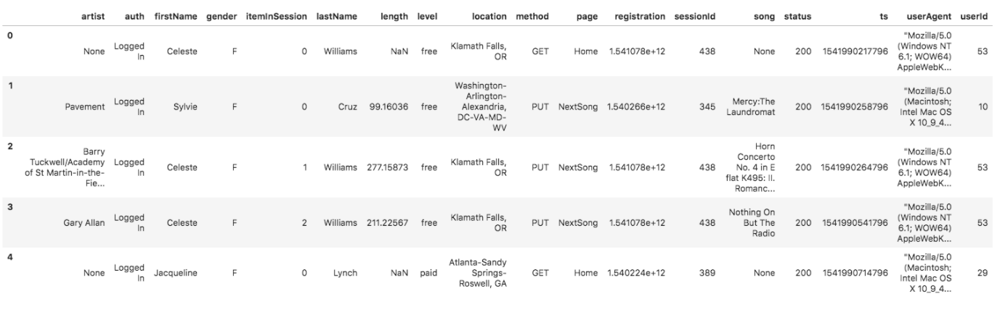

# Project: Data Modeling with Postgres

## 1. Introduction

A startup called Sparkify wants to analyze the data they've been collecting on songs and user activity on their new
music streaming app. The analytics team is particularly interested in understanding what songs users are listening to.
Currently, they don't have an easy way to query their data, which resides in a directory of JSON logs on user activity
on the app, as well as a directory with JSON metadata on the songs in their app.

They'd like a data engineer to create a Postgres database with tables designed to optimize queries on song play
analysis, and bring you on the project. Your role is to create a database schema and ETL pipeline for this analysis.
You'll be able to test your database and ETL pipeline by running queries given to you by the analytics team from
Sparkify and compare your results with their expected results.

### 1.1 Project Description

In this project, you'll apply what you've learned on data modeling with Postgres and build an ETL pipeline using Python.
To complete the project, you will need to define fact and dimension tables for a star schema for a particular analytic
focus, and write an ETL pipeline that transfers data from files in two local directories into these tables in Postgres
using Python and SQL.

## 2. Dataset

### 2.1 Song Dataset

The first dataset is a subset of real data from the [Million Song Dataset](https://labrosa.ee.columbia.edu/millionsong/)
. Each file is in JSON format and contains metadata about a song and the artist of that song. The files are partitioned
by the first three letters of each song's track ID. For example, here are filepaths to two files in this dataset.

```
song_data/A/B/C/TRABCEI128F424C983.json
song_data/A/A/B/TRAABJL12903CDCF1A.json
```

And below is an example of what a single song file, `TRAABJL12903CDCF1A.json`, looks like.

```
{
    "num_songs": 1, 
    "artist_id": "ARJIE2Y1187B994AB7", 
    "artist_latitude": null, 
    "artist_longitude": null, 
    "artist_location": "", 
    "artist_name": "Line Renaud", 
    "song_id": "SOUPIRU12A6D4FA1E1", 
    "title": "Der Kleine Dompfaff", 
    "duration": 152.92036, "year": 0
}
```

### 2.2 Log Dataset

The second dataset consists of log files in JSON format generated by
this [event simulator](https://github.com/Interana/eventsim) based on the songs in the dataset above. These simulate
activity logs from a music streaming app based on specified configurations.

The log files in the dataset you'll be working with are partitioned by year and month. For example, here are filepaths
to two files in this dataset.

```
log_data/2018/11/2018-11-12-events.json
log_data/2018/11/2018-11-13-events.json
```

And below is an example of what the data in a log file, `2018-11-12-events.json`, looks like.



If you would like to look at the JSON data within log_data files, you will need to create a pandas dataframe to read the
data. Remember to first import JSON and pandas libraries.

`df = pd.read_json(filepath, lines=True)`

For example, `df = pd.read_json('data/log_data/2018/11/2018-11-01-events.json', lines=True)` would read the data
file `2018-11-01-events.json`.

In case you need a refresher on JSON file formats, here is a helpful video.

### 2.3 Schema for Song Play Analysis

Using the song and log datasets, you'll need to create a star schema optimized for queries on song play analysis. This
includes the following tables.

### 2.4 Fact Table

1. `songplays` - records in log data associated with song plays i.e. records with page _NextSong_

```
songplay_id, 
start_time, 
user_id, 
level, 
song_id, 
artist_id, 
session_id, 
location, 
user_agent
```

### 2.5 Dimension Tables

1. `users` - users in the app
    ```
    user_id, 
    first_name, 
    last_name, 
    gender, 
    level
    ```
2. `songs` - songs in music database
    ```
    song_id, 
    title, 
    artist_id, 
    year, 
    duration
    ```
3. `artists` - artists in music database
    ```
    artist_id, 
    name, 
    location, 
    latitude, 
    longitude
    ```
4. `time` - timestamps of records in songplays broken down into specific units
   ```
   start_time, 
   hour, 
   day, 
   week, 
   month, 
   year, 
   weekday
   ```

## 3. Project Instructions

### 3.1 Project Template

To get started with the project, go to the workspace on the next page, where you'll find the project template files. You
can work on your project and submit your work through this workspace. Alternatively, you can download the project
template files from the Resources' folder if you'd like to develop your project locally.

In addition to the data files, the project workspace includes six files:

* `test.ipynb` displays the first few rows of each table to let you check your database.
* `create_tables.py` drops and creates your tables. You run this file to reset your tables before each time you run your
  ETL scripts.
* `etl.ipynb reads` and processes a single file from `song_data` and `log_data` and loads the data into your tables.
  This notebook contains detailed instructions on the ETL process for each of the tables.
* `etl.py` reads and processes files from `song_data` and `log_data` and loads them into your tables. You can fill this
  out based on your work in the ETL notebook.
* `sql_queries.py` contains all your sql queries, and is imported into the last three files above.
* `README.md` provides discussion on your project.

### 3.2 Project Steps

Below are steps you can follow to complete the project:

#### 3.2.1  Create Tables

1. Write `CREATE` statements in `sql_queries.py` to create each table.
2. Write `DROP` statements in `sql_queries.py` to drop each table if it exists.
3. Run `create_tables.py` to create your database and tables.
4. Run `test.ipynb` to confirm the creation of your tables with the correct columns. Make sure to click "Restart kernel"
   to close the connection to the database after running this notebook.

#### 3.2.2 Build ETL Processes

Follow instructions in the etl.ipynb notebook to develop ETL processes for each table. At the end of each table section,
or at the end of the notebook, run test.ipynb to confirm that records were successfully inserted into each table.
Remember to rerun create_tables.py to reset your tables before each time you run this notebook.

#### 3.2.3 Build ETL Pipeline

Use what you've completed in `etl.ipynb` to complete `etl.py`, where you'll process the entire datasets. Remember to
run `create_tables.py` before running `etl.py` to reset your tables. Run `test.ipynb` to confirm your records were
successfully inserted into each table.

#### 3.2.4 Document Process

Do the following steps in your `README.md` file.

1. Discuss the purpose of this database in the context of the startup, Sparkify, and their analytical goals.
2. State and justify your database schema design and ETL pipeline.
3. [Optional] Provide example queries and results for song play analysis. Here's
   a [guide](https://www.markdownguide.org/basic-syntax/) on Markdown Syntax.

**NOTE**: You will not be able to run test.ipynb, etl.ipynb, or etl.py until you have run create_tables.py at least once
to create the sparkifydb database, which these other files connect to.

#### 3.2.5. Project Rubric

Read the project [rubric](https://review.udacity.com/#!/rubrics/2500/view) before and during development of your project
to ensure you meet all specifications.

## 4. Deliverables

Your deliverables will be a zip file or GitHub repo containing the files for your project. Alternatively, you can submit
your project through the workspace.

Ensure you meet specifications for all items in the Project Rubric. Your project must Meet Specifications in each
category in order for your submission to pass.

It can take us up to a week to grade the project, but in most cases it is much faster. You will get an email once your
submission has been reviewed. In the meantime, you should feel free to proceed with your learning journey by continuing
on to the next module in the program.

### 4.1 Project Submission Checklist

Before submitting your project, please review and confirm the following items.

* I am confident all rubric items have been met and my project will pass as submitted.
* Project builds correctly without errors and runs.
* All required functionality exists and my project behaves as expected per the project's specifications.

Once you have checked all these items, you are ready to submit!

## 5. Installation

`master` branch loads json files using iteration over pandas dataframe rows. `bulk_etl` branch uses Postgres `COPY`
command to copy json files to database in bulk. It is much faster. It also includes several `CHECK` constraints.

Run the `create_tables.py` script in the project's root directory to set up your database and create tables:

```
create_tables.py
>>> Setting up database...
>>> Dropping tables...
>>> Setting up tables...
>>> 
>>> Process finished with exit code 0
```

Run the `etl.py` script to process log and song json files to snowflake schema `sparkifydb` in Postgres DBMS.

```
etl.py

>>> 71 files found in data/song_data
>>> 1/71 files processed.
>>> 2/71 files processed.
>>> 3/71 files processed.
>>> 4/71 files processed.
>>> 5/71 files processed.
>>> 6/71 files processed.
>>> 7/71 files processed.
>>> 8/71 files processed.
>>> 9/71 files processed.
>>> 10/71 files processed.
>>> 11/71 files processed.
>>> 12/71 files processed.
>>> 13/71 files processed.
>>> 14/71 files processed.
>>> 15/71 files processed.
>>> 16/71 files processed.
>>> 17/71 files processed.
>>> 18/71 files processed.
>>> 19/71 files processed.
>>> 20/71 files processed.
>>> 21/71 files processed.
>>> 22/71 files processed.
>>> 23/71 files processed.
>>> 24/71 files processed.
>>> 25/71 files processed.
>>> 26/71 files processed.
>>> 27/71 files processed.
>>> 28/71 files processed.
>>> 29/71 files processed.
>>> 30/71 files processed.
>>> 31/71 files processed.
>>> 32/71 files processed.
>>> 33/71 files processed.
>>> 34/71 files processed.
>>> 35/71 files processed.
>>> 36/71 files processed.
>>> 37/71 files processed.
>>> 38/71 files processed.
>>> 39/71 files processed.
>>> 40/71 files processed.
>>> 41/71 files processed.
>>> 42/71 files processed.
>>> 43/71 files processed.
>>> 44/71 files processed.
>>> 45/71 files processed.
>>> 46/71 files processed.
>>> 47/71 files processed.
>>> 48/71 files processed.
>>> 49/71 files processed.
>>> 50/71 files processed.
>>> 51/71 files processed.
>>> 52/71 files processed.
>>> 53/71 files processed.
>>> 54/71 files processed.
>>> 55/71 files processed.
>>> 56/71 files processed.
>>> 57/71 files processed.
>>> 58/71 files processed.
>>> 59/71 files processed.
>>> 60/71 files processed.
>>> 61/71 files processed.
>>> 62/71 files processed.
>>> 63/71 files processed.
>>> 64/71 files processed.
>>> 65/71 files processed.
>>> 66/71 files processed.
>>> 67/71 files processed.
>>> 68/71 files processed.
>>> 69/71 files processed.
>>> 70/71 files processed.
>>> 71/71 files processed.

>>> 30 files found in data/log_data
>>> 1/30 files processed.
>>> 2/30 files processed.
>>> 3/30 files processed.
>>> 4/30 files processed.
>>> 5/30 files processed.
>>> 6/30 files processed.
>>> 7/30 files processed.
>>> 8/30 files processed.
>>> 9/30 files processed.
>>> 10/30 files processed.
>>> 11/30 files processed.
>>> 12/30 files processed.
>>> 13/30 files processed.
>>> 14/30 files processed.
>>> 15/30 files processed.
>>> 16/30 files processed.
>>> 17/30 files processed.
>>> 18/30 files processed.
>>> 19/30 files processed.
>>> 20/30 files processed.
>>> 21/30 files processed.
>>> 22/30 files processed.
>>> 23/30 files processed.
>>> 24/30 files processed.
>>> 25/30 files processed.
>>> 26/30 files processed.
>>> 27/30 files processed.
>>> 28/30 files processed.
>>> 29/30 files processed.
>>> 30/30 files processed.
>>> 
>>> Process finished with exit code 0

```

## 5. Project Structure Description

```
Project:                                       
│   README.md                                   # Project instruction and documentation                         
│   sql_queries.py                              # Module with all sql queries 
│   .gitignore                                  # All checkpoints, data are not part of repository
│   test.ipynb                                  # Unit test to validate ETL pipeline
│   etl.ipynb                                   # ETL pipeline development
│   etl.py                                      # ETL pipeline production
│   create_tables.py                            # Creates snowflake scheme in production
│   dend-p1-lessons-cheat-sheet.pdf             
│
└───assets
        01_log_dataset.png                      # Assets for README.md
```